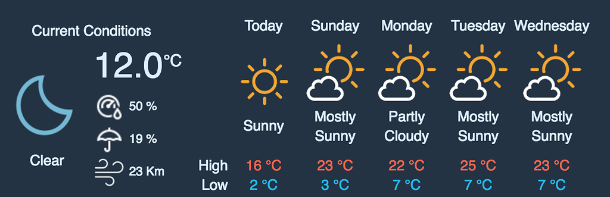

# NMP - Weather Telemetry

Please check [SUBISSION.md](./SUBMISSION.md).

<details>

<summary>Project Brief</summary>

## Background

On-track weather data is useful to collect, as it allows vehicle data to be analysed in the context of external environmental variables. For example, determining how much wind velocity impacts the aerodynamics, determining what levels of precipitation cause the car to hydroplane, or how track temperatures affect tyre performance.

However, viewing a stream of continuous raw data on a terminal is not very useful. Hence, after the hardware to collect this raw numerical data is set up, the data stream must be processed appropriately and displayed on a frontend.

## Task 1 - Backend

You will be given a module `weather_output.ts` which contains a function, `generate_weather_data`, that emulates the data output from a weather station by returning an object with the following data points:

- Ambient Temperature
- Track Temperature
- Humidity
- Precipitation
- Wind Speed
- Wind Direction

You must not change `weather_output.ts` - instead, import the function into your program and call it in a timed loop to continuously receive data. The emulated data will have errors (see the comment in `weather_output.ts`), so some validation of this raw data in your backend is required.

Then you must stream this data to a frontend client via UDP sockets. This data must then be made available to the user interface. Your backend should also ideally implement an API with routes to start and stop the data stream from the frontend, as well as any other useful routes.

A skeleton server will be provided written in Typescript / Node.js.

## Task 2 - User Interface

The Redback engineers in the garage need to see live data from the weather station on a webpage, to help them correlate the data with the vehicle’s performance on track.

Your first task here is to design a clear, intuitive user interface in [Figma](https://www.figma.com/) that displays all this data in the form of live charts, widgets and more.

Think of adding configuration options, such as a method for users to change the size/positioning of widgets, change the scale of charts, create multiple tabs, pause the data stream display, change themes or really anything else that would enhance functionality or the user experience. Feel free to be as creative as you would like!

You will be given a blank React.js + Typescript project in which you will program and create the UI that you have designed.

## (Extension) Task 3 - Cloud Deployment

Once you have a weather station app with the following components:

- Back-end
- Front-end
- API Gateway (Kong Gateway)

Your project should first be able to start locally using docker-compose.

Then, create a working minikube (local) deployment. You must also document your deployment with a diagram which illustrates your Kubernetes architecture (Pods, Services, Ingress, Helm, VPC, or any other Resources used).

Finally generate each service into Docker images, push them to a Docker Hub Private Registry then deploy all into a Kubernetes cluster run by a managed Kubernetes service such as AWS EKS (Elastic Kubernetes Service), IBM IKS (IBM Kubernetes Service), GKE (Google Kubernetes Engine) etc.

It is recommended to use an IaC (Infrastructure as Code) tool such as Terraform to deploy and automate all the resources and providers in the cloud.

## (Extension) Task 4 - Data Persistence and Log Replaying

Implement a method of logging the weather data and storing each session of logged data in some form of persistent data storage.

For example, if weather data was logged on the 4th of March, starting at 15:30:45 and ending at 15:36:12, that would count as a single session.

A client should be able to browse and search through the logged sessions in the frontend, and either download the raw data for a session, or replay the logged data in the session on the charts/widgets in the UI.

The specific design and implementation details of the features in this task are up to you to decide.

## (Extension) Task 5 - Weather API

Design and create widgets to show things like a live rainfall radar from a free weather API or even embed weather maps. This is another task where you can showcase your creativity!

<p align="center">
  
</p>
</br>

**After these tasks are completed, write some basic documentation (approx. 1-2 pages, .md or .pdf format) outlining how your application works and including any additional setup steps.**

## Running the Code

The following assumes that you have `node v14.17.5` installed.

- If you do not, then install [node](https://nodejs.org/en/download/), and then follow this [guide](https://www.geeksforgeeks.org/how-to-install-the-previous-version-of-node-js-and-npm/) to check and change node to the correct versions for Windows. For Linux and MacOS, install and use [nvm](https://github.com/nvm-sh/nvm) to change the node version.

First, install `ts-node` with

```bash
npm install -g ts-node
```

### Emulator

The only thing to run here is the weather_output_test program, which simply calls the `generate_weather_data()` function in a loop.
Run

```bash
cd emulator/
npm install
npm test
```

and you should see a steady stream of randomly generated weather data.

### Server

First, run

```bash
cd server/
npm install
npm run build
```

then, to run the server itself,

```bash
node .
```

To test whether the API is working, open a browser at `localhost:8000/` and see if a _'Hello World`'_ message appears.

To test whether the boilerplate UDP stream is working, open a seperate terminal and run

```bash
npm test
```

while you are running the server. This will run the testUdpReceiver program, which should print the received UDP data.

### UI

Run

```
cd ui
npm install
npm start
```

If for some reason you want to change the manner in which the above programs are run, edit `package.json` and/or `tsconfig.json` in each directory.

## Submission

Fork this git repository, and then add all your code and documentation to the forked repository. This will include:

- Functional server code
- A link to the Figma designs
- Functional UI code
- A .md or .pdf file outlining how the program works
- YAML files to replicate Kubernetes Deployment, as well as Docker build files for your images (Task 3)
- A Kubernetes architecture diagram (Task 3)
- A URL to the deployed application somewhere in your documentation – the application should be accessible via the browser (Task 3)

Finally, you will be demonstrating and presenting your application at the end of the NMP. Feel free to make additional slides, or just present your report.

## Resources

### Backend

- https://nodejs.dev/learn
- https://expressjs.com/
- https://www.typescriptlang.org/docs/handbook/typescript-from-scratch.html
- https://nodejs.org/api/dgram.html
- https://www.youtube.com/watch?v=-MTSQjw5DrM
- https://www.youtube.com/watch?v=ENrzD9HAZK4
- https://www.youtube.com/watch?v=zQnBQ4tB3ZA

### Frontend

- https://reactjs.org/
- https://react-typescript-cheatsheet.netlify.app/docs/basic/setup
- https://reactjs.org/tutorial/tutorial.html
- https://www.youtube.com/watch?v=hQAHSlTtcmY
- https://www.youtube.com/watch?v=Tn6-PIqc4UM

### Cloud

Kubernetes/Docker documentation is your friend.

- https://kubernetes.io/docs/home/
- https://minikube.sigs.k8s.io/docs/start/
- https://docs.docker.com/
- https://curity.io/resources/learn/integration-kong-open-source/
- https://docs.konghq.com/gateway/2.7.x/reference/db-less-and-declarative-config
- https://registry.terraform.io/browse/providers

Managed Kubernetes service documentation:

(You are welcome to use any managed Kubernetes Service available to you. For the purposes of this project, you may find IBM IKS useful as it has a free tier available.)

- https://cloud.ibm.com/docs/containers?topic=containers-getting-started
- https://docs.aws.amazon.com/eks/latest/userguide/getting-started.htm

</details>
