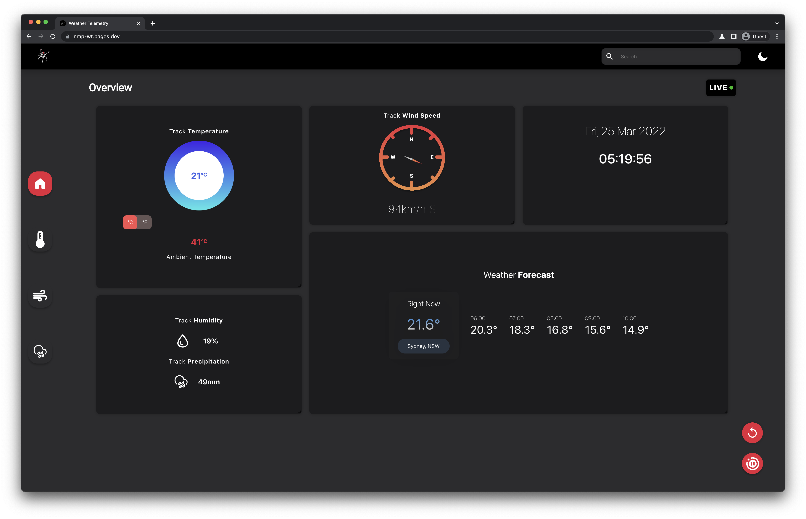
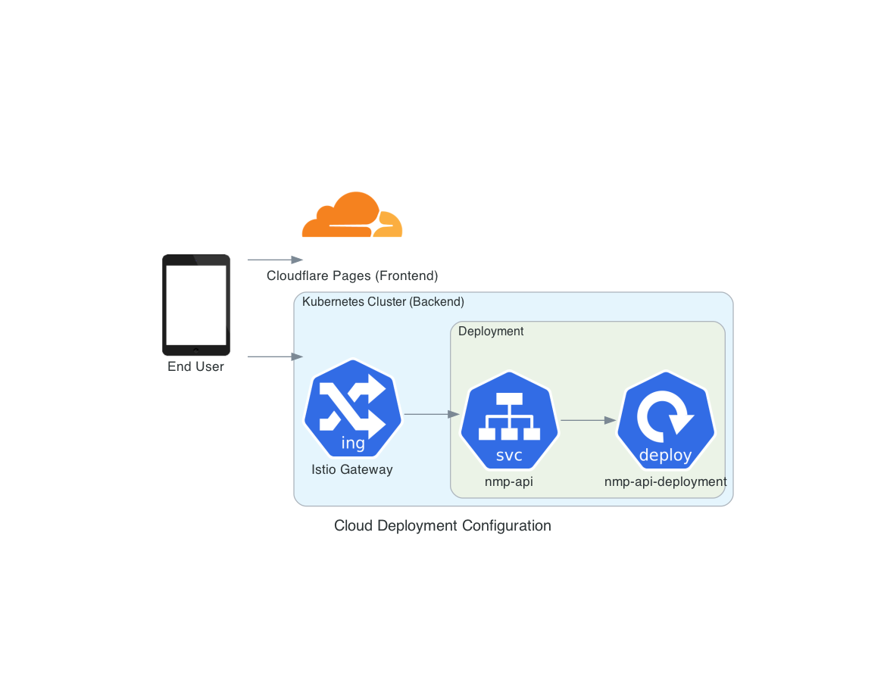

# NMP Submission

## Summary

All core components of the project were successfully implemented. Out of the extension tasks, only task 4 has not been completed (persistence).

- A live copy of the frontend is available [here](https://nmp-wt.pages.dev).
- The figma design is available [here](https://www.figma.com/file/v3SkkNhikxfwnUrxjTvgH6/Redback-racing?node-id=0%3A1).

### Completed Tasks

- [x] Task 1 (backend)
- [x] Task 2 (frontend)
- [x] Task 3 (cloud deployment)
- [ ] Task 4 (persistence)
- [x] Task 5 (API Integration)

### Further Application/Deployment details

The backend is entirely containerised and can be built locally, or a pre-built image may be pulled. The backend exposes port `8000` as its HTTP endpoint.

To deploy this application, you will need:

- A kubernetes cluster
- Istio deployed into the cluster (default configuration is fine)
- LoadBalancer support on your cluster

To deploy this application:

1. Navigate to the `/deployment/manifests` directory. Ensure that the values inside `gateway.yml` and `vsvc.yml` (specifically the `host` field) is set to an appropriate domain name, or all with `*`.
2. Change the image tag within `deploy.yml` to be the latest image, or set it to a specific image tag.
3. Apply all the manifests into your cluster with `kubectl apply -f .`.
4. Wait for the pod to be scheduled onto a node and running.

## Implementation Details

### Backend

The backend was implemented using express on top of a TypeScript, NodeJS stack. We used express-ws as the express handler for websockets.

The backend essentially has a variable that is declared to an interval of 259 ms. When the `/api/start` endpoint is called, the variable is initialised with a live interval that calls the `sendData()` function. This function calls the generation dummy function, which cleans the data and then sends the data to any connected websocket clients.

When `/api/stop` is called, the interval is cleared and clients will not be sent any data.

### Frontend

The frontend is implemented with react and TypeScript. For styling, we used a combination of CSS modules and CSS-in-JS with [stitches](https://stitches.dev).

The primary design of the site is centered around a main dashboard page that allows users to view all data live from the API. Users can also pause or resume live data transmission from the dashboard page.

### Cloud Deployment

The frontend of the page is deployed on Cloudflare pages. CF Pages automatically updates the live version of the site whenever a commit is pushed to the main branch.

The backend of the site is hosted on a kubernetes cluster, running the Istio service mesh.

### Task 4 (Plan)

If this feature were to be implemented, it would involve streaming data to a QuestDB (tsdb) database. This is a time series database, which means it is optimised for storing time series data, such as log records.

When someone presses the start button on the dashboard, the backend would begin saving this data to a new `session` in the database. When the streaming is paused on the frontend, the backend will then stop storing the information.

Users will then be able to view a list of previous sessions from the frontend, and select a session to view each of the values recorded during the session's timeframe.

### Task 5

This project uses the open meteo API as its source for live weather details. An approximate set of coordinates are hardcoded into the application, and an improvement point could be to ask the user to allow access to their location (or have a preset list of locations).

For more precise data, an authentication system would have to be built to prevent leaking of the API key and to allow the frontend access to other information such as predicted rainfall, cloud coverage, etc.
